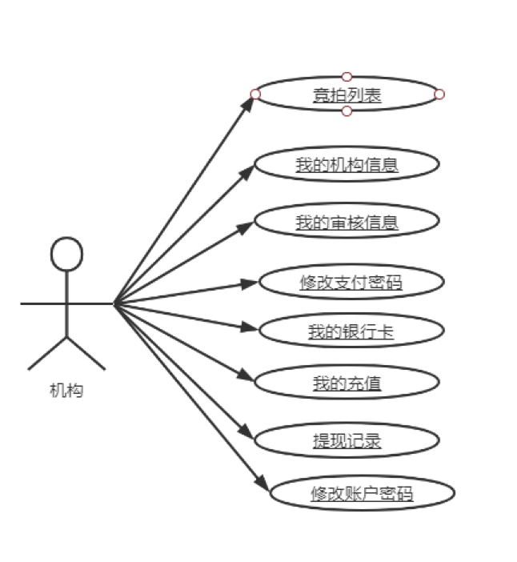
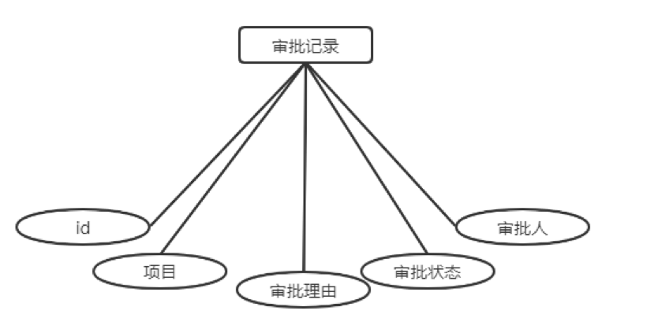
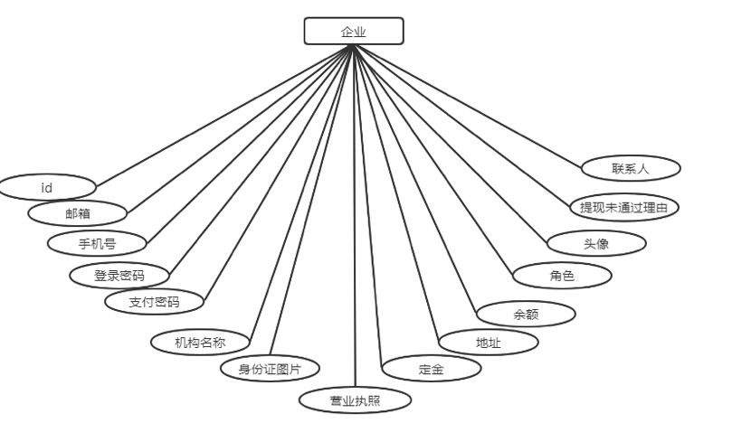
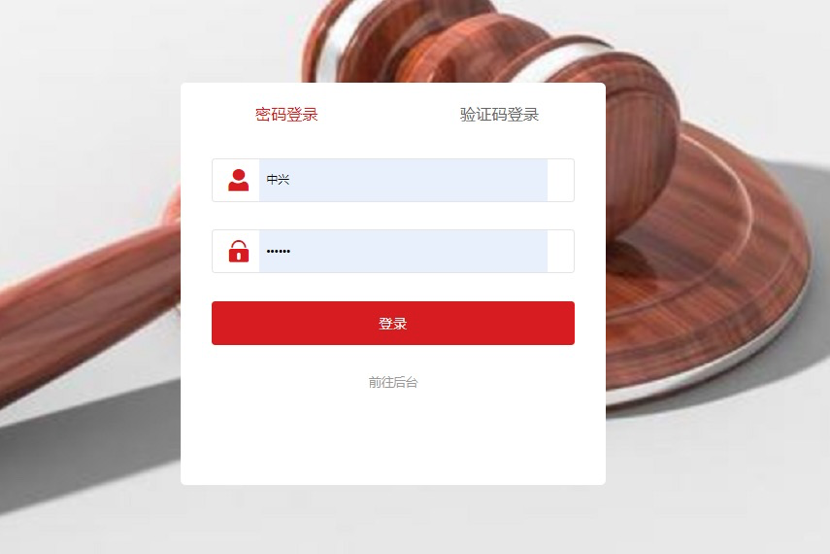
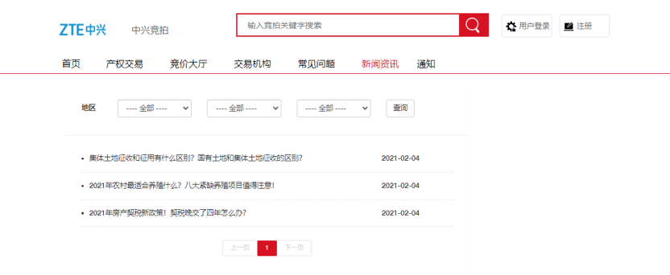
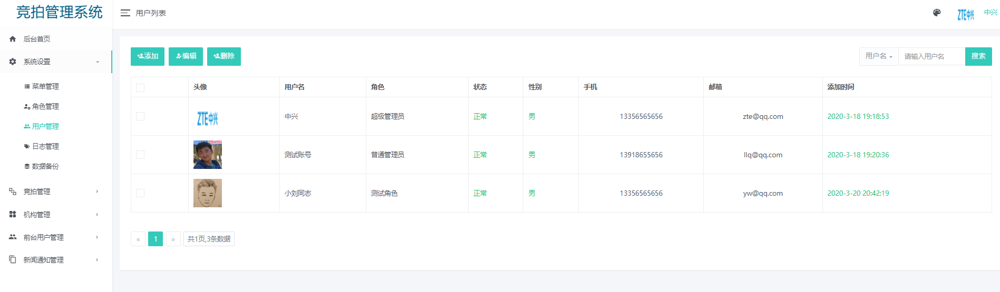

# 竞拍系统的设计与实现

## 摘要

&emsp;&emsp;随着经济的发展和人们生活水平的提高，越来越多的人开始收集艺术品和收藏品。当前流行的电子商务网站大多是线下商品的网上销售系统，所销售的商品与超市差不多，销售的价格也是固定的。本文所研究和开发的系统为艺术品和收藏品的爱好者提供一个网上交易平台。 拍卖者将拍卖物品的照片、名称、描述、鉴定证明等信息上传至网站。竞拍者可以搜索、查看被拍卖物品的信息，对于感兴趣的物品，可以参加竞拍。系统按照预定的竞拍时间拍卖物品，最后出价最高者获得拍卖物品。拍卖管理员负责审核拍卖品和用户的拍卖资格或竞买资格，还负责处理交易纠纷和投诉。拍卖成功后，竞买人将交易金暂存于网站，拍卖人发货，当竞买人收到物品并确认之后，网站才将交易金支付给拍卖者。网站与银行、物流公司、电信公司相连，以进行交易结算、确定发货和收货和及时通知拍卖双方。 系统分由五个功能模块构成，分别是用户信息管理、拍卖物品管理、拍卖业务管理、投诉纠纷管理和外部接口管理。每个部分由需求分析、概要设计、数据库设计、用户界面、核心数据结果和操作接口、关键代码和流程图等构成。系统的设计基于MVC模式，分为用户界面、业务逻辑和数据操作三层。系统的开发基于SpringBoot+FreeMarker技术，采用MySQL数据库管理系统存储数据。

**关键词**：竞拍；SpringBoot；FreeMarker；MySQL

## ABSTRACT

&emsp;&emsp;With the development of economy and the improvement of people's living standards, more and more people begin to collect art and collectibles. Most of the current popular e-commerce websites are online sales systems for offline goods. The goods they sell are similar to supermarkets, and the sales price is fixed. The system researched and developed in this paper provides an online trading platform for art lovers and collectors. The auctioneer will upload the photos, names, descriptions, identification certificates and other information of the auction items to the website. Bidders can search and view the information of the items being auctioned. For the items they are interested in, they can participate in the auction. The system auctions the items according to the predetermined auction time, and the highest bidder gets the auction items. The auction administrator is responsible for examining the auction qualification or bidding qualification of the auction products and users, and is also responsible for handling transaction disputes and complaints. After the auction is successful, the bidder will temporarily store the transaction money in the website, and the auctioneer will deliver the goods. When the bidder receives the goods and confirms, the website will pay the transaction money to the auctioneer. The website is connected with banks, logistics companies and telecom companies for transaction settlement, delivery and receipt confirmation, and timely notification to auction parties. The system consists of five functional modules, which are user information management, auction item management, auction business management, complaint and dispute management and external interface management. Each part consists of requirement analysis, outline design, database design, user interface, core data result and operation interface, key code and flow chart. The design of the system is based on MVC mode, which is divided into three layers: user interface, business logic and data operation. The development of the system is based on springboot + FreeMarker technology, using MySQL as the database, using MySQL database management system to store data.

**Keywords:** auction; Spring Boot;FreeMarker;MySql

## 一、绪论

### 1.1 课题背景、目的及意义

#### 1.1.1 课题背景

&emsp;&emsp;2004年中国网上拍卖市场规模实现了217.8%的增长，全年成交金额从2003年的10.7亿人民币直增至34亿。初步预期，国内网上拍卖市场今后三年的市场规模年均增长率将达到84％，2007年总市场规模约为210亿人民币。

&emsp;&emsp;2004年，中国拍卖网站所有注册用户当中，有过成功交易体验的用户约为400万人，占全体非重复注册用户群的三分之一。

&emsp;&emsp;2004年，中国网上拍卖市场上总共约有4250万件商品，而所有这些登录商品的成交率约为40％，总成交商品量约在1700万件左右，所有成交商品的平均交易价格约计200元。     ——《2004年中国网上拍卖研究报告》

&emsp;&emsp;互联网让每一个人都可以把自己心爱的物品拿出来与人交换，让普通人之间的交易变得如此简单而有趣。

&emsp;&emsp;网上拍卖，前景看好

#### 1.1.2 课题目的和意义

&emsp;&emsp;本系统主要目的是方便用户浏览本网站的拍品，对自己感兴趣的商品进行竞价拍卖，最终出价最高者赢得此商品。最后通过生成订单、付款、发货、收货等一系列运作，完成网上拍卖流程，减少客户常规拍卖过程中浪费的时间、人力和物力。随着经济地快速发展，人们在满足基本上火需求后，对其他方面的需求越来越大，基于这种情况，拍卖以其独特的魅力，成为很多人追逐的购物方式，这种购物方式本身所具备的公平、公开等方式，也是它成为人们喜欢的购物方式的原因。

## 二、相关技术介绍

### 2.1 javascript

&emsp;&emsp;JavaScript是一种基于对象和事件驱动并具有相对安全性的客户端脚本语言。同时也是一种广泛用于客户端Web开发的脚本语言，常用来给HTML网页添加动态功能，比如响应用户的各种操作。它最初由网景公司（Netscape）的Brendan Eich设计，是一种动态、弱类型、基于原型的语言，内置支持类。

&emsp;&emsp;Javascript语言与Java语言在语法上比较相似，但随着对Javascript的深入了解后你会发现，它们说到底是两种语言。

### 2.2 Ajax

&emsp;&emsp;Ajax全称为“Asynchronous JavaScript and XML”(异步JavaScript和XML)，是指一种创建交互式网页应用的网页开发技术。Ajax技术可以提供高度交互的Web应用，给予用户更丰富的页面浏览体验，Ajax功能的实现主要依靠XMLHttpRequest对象及其属性和方法、发送请求和处理响应。

### 2.3 MySQL

&emsp;&emsp;MySQL是一个开放源码的小型关联式数据库管理系统，开发者为瑞典MySQL AB公司。MySQL被广泛地应用在Internet上的中小型网站中。由于其体积小、速度快、总体拥有成本低，尤其是开放源码这一特点，许多中小型网站为了降低网站总体拥有成本而选择了MySQL作为网站数据库。

&emsp;&emsp;自从Oracle公司收购了MySQL后不久，就发行了MySQL的企业版（不再免费）。

### 2.4 Spring Boot框架

&emsp;&emsp;Spring Boot框架中有两个非常重要的策略：开箱即用和约定优于配置。开箱即用，Outofbox，是指在开发过程中，通过在MAVEN项目的pom文件中添加相关依赖包，然后使用对应注解来代替繁琐的XML配置文件以管理对象的生命周期。这个特点使得开发人员摆脱了复杂的配置工作以及依赖的管理工作，更加专注于业务逻辑。约定优于配置，Convention over configuration，是一种由Spring Boot本身来配置目标结构，由开发者在结构中添加信息的软件设计范式。这一特点虽降低了部分灵活性，增加了BUG定位的复杂性，但减少了开发人员需要做出决定的数量，同时减少了大量的XML配置，并且可以将代码编译、测试和打包等工作自动化。

### 2.5 Freemarker模版引擎

&emsp;&emsp;FreeMarker是一款模板引擎： 即一种基于模板和要改变的数据， 并用来生成输出文本（HTML网页、电子邮件、配置文件、源代码等）的通用工具。 它不是面向最终用户的，而是一个Java类库，是一款程序员可以嵌入他们所开发产品的组件。

### 2.6 B/S模式

&emsp;&emsp;B/S（Browser/Server）结构即浏览器和服务器结构。它是随着Internet技术的兴起，对C/S结构的一种变化或者改进的结构。在这种结构下，用户工作界面是通过WWW浏览器来实现，极少部分事务逻辑在前端（Browser）实现，但是主要事务逻辑在服务器端（Server）实现，形成所谓三层结构。这样就大大简化了客户端电脑载荷，减轻了系统维护与升级的成本和工作量，降低了用户的总体成本（TCO）。以目前的技术看，局域网建立B/S结构的网络应用，并通过Internet/Intranet模式下数据库应用，相对易于把握、成本也是较低的。它是一次性到位的开发，能实现不同的人员，以不同的接入方式访问和操作共同的数据库；它能有效地保护数据平台和管理访问权限，服务器数据库也很安全 。

&emsp;&emsp;B/S模式最大的优点就是可以在任何地方进行操作而不需客户端安装任何专门的软件。只要有一台能上网的电脑就能使用，客户端零维护，系统的扩展非常容易。它具有分布性特点，可以随时随地进行业务处理。业务扩展简单方便，通过增加网页即可增加服务器功能。在维护方面，只需要改变网页，即可实现所有用户的同步更新，共享性较强。它实现了跨平台的系统集成服务，提供了异种机、异种网、异种应用服务的联机、联网、统一服务的开放性基础。而C/S模式开发是具有针对性的，对客户端有一定的要求，因此缺少通用性，移植性，业务变更不灵活，在维护、系统升级方面都有很大的麻烦而且兼容性较差，对于不同的开发工具，相互之间很难兼容，具有较大的局限性，新技术不便于使用。另外，它的开发成本较高，需要具有一定专业水准的技术人员才能完成。图2-1所示是B/S模式应用系统网络结构图：


<center>图2-1 B/S模式应用系统网络结构图</center>

### 2.7 系统开发平台及运行环境

#### 2.7.1 系统开发平台

1. IDEA

   &emsp;&emsp;IDEA 全称 IntelliJ IDEA，是java编程语言开发的集成环境。IntelliJ在业界被公认为最好的java开发工具，尤其在智能代码助手、代码自动提示、重构、JavaEE支持、各类版本工具(git、svn等)、JUnit、CVS整合、代码分析、 创新的GUI设计等方面的功能可以说是超常的。IDEA是JetBrains公司的产品，这家公司总部位于捷克共和国的首都布拉格，开发人员以严谨著称的东欧程序员为主。它的旗舰版本还支持HTML、CSS、PHP、MySQL、Python等。免费版只支持Java、Kotlin等少数语言。在Eclipse的官方网站中提供了一个Java EE版的Eclipse IDE。应用Eclipse IDE for Java EE，既可以创建Java项目，也可以创建动态Web项目。

   &emsp;&emsp;最突出的功能是调试（Debug)，可以对Java代码，JavaScript、JQuery、Ajax等技术进行调试。

   &emsp;&emsp;比如查看Map类型的对象，如果实现类采用的是哈希映射，则会自动过滤空的Entry实例。

   &emsp;&emsp;其次，需要动态Evaluate一个表达式的值，比如我得到了一个类的实例，但是并不知晓它的API，可以通过Code Completion点出它所支持的方法。

   &emsp;&emsp;最后，在多线程调试的情况下，Log on console的功能可以帮你检查多线程执行的情况。

2. Maven

   &emsp;&emsp;Maven项目对象模型(POM)，可以通过一小段描述信息来管理项目的构建，报告和文档的项目管理工具软件。

   &emsp;&emsp;Maven是一个项目管理工具，它包含了一个项目对象模型 (Project Object Model)，一组标准集合，一个项目生命周期(Project Lifecycle)，一个依赖管理系统(Dependency Management System)，和用来运行定义在生命周期阶段(phase)中插件(plugin)目标(goal)的逻辑。当你使用Maven的时候，你用一个明确定义的项目对象模型来描述你的项目，然后Maven可以应用横切的逻辑，这些逻辑来自一组共享的（或者自定义的）插件。

   &emsp;&emsp;Maven 有一个生命周期，当你运行 mvn install 的时候被调用。这条命令告诉 Maven 执行一系列的有序的步骤，直到到达你指定的生命周期。遍历生命周期旅途中的一个影响就是，Maven 运行了许多默认的插件目标，这些目标完成了像编译和创建一个 JAR 文件这样的工作。

   &emsp;&emsp;此外，Maven能够很方便的帮你管理项目报告，生成站点，管理JAR文件，等等。

#### 2.7.2 运行环境

##### 2.7.2.1 硬件环境

&emsp;&emsp;竞拍管理系统服务器端硬件环境。

<center>表2-1 硬件环境表</center>

|   指标项   |   配置参数   |
| :----: | :----: |
|   主机型号   |   HP Z600   |
|   CPU 型号   |   Xeon E5606 2.13GHz   |
|   CPU 数量   |   2   |
|   显卡   |   ATI FirePro V4800 1GB   |
|   内存   |   DDR3 1333MHz ECC Unbuffered DIMM 24GB   |
|   硬盘   |   SATA 600GB*4   ｜|

##### 2.7.2.2 软件环境

&emsp;&emsp;竞拍管理系统服务器端软件环境。

<center>表2-2 软件环境表</center>

| 名称           | 版本                   |
| -------------- | ---------------------- |
| 操作系统       | Windows Server 2012 R2 |
| 开发工具       | IDEA                   |
| 数据库         | MySQL 8.0.33           |
| Maven          | Maven 3.9.1            |
| 软件开发工具包 | JDK 1.8.371            |

## 三、系统需求分析

&emsp;&emsp;当前许多人还是使用线下的方式进行商品的拍卖，这样的拍卖方式有很大的局限性。无论是商品提供者还是竞拍者都必须到达现场。而在快节奏的生活年代，很少有人能够参加这种线下的竞拍方式。在线上建立起一个竞拍的网站。有很都多的遍历，比如买家可以在休闲的时间查找自己喜欢的拍品。将它进行收藏。减少人的外出时间。

### 3.1 功能需求分析

&emsp;&emsp;竞拍系统是根据市场需求的实际情况按照网络化的需求开发的，它的目标非常明确，即通过建立竞拍平台，将原来定时定点线下交易方式转变成通过网络平台进行竞拍的线上模式，使竞拍更加便捷、安全、规范和有针对性。

&emsp;&emsp;系统功能需求整体上分为用户使用功能和系统管理功能，其中用户使用功能包括用户浏览竞拍产品、用户登录、用户注册、用户查看常见问题、用户查看新闻资讯、用户查看个人信息等功能；系统管理功能包括管理员管理用户、管理员管理竞拍品、和管理员管理系统设置等功能。

&emsp;&emsp;根据以上功能需求分析，通过用例图来描述系统的主要功能。构建用例模型的第一步是确定模型中的使用者有哪些，确定使用者的原则有：谁是系统的维护者、谁是系统的参与者等。维护者处于系统内部，对系统有绝对的控制权；而参与者一般都位于系统的外部，处于系统的控制之外。

&emsp;&emsp;现在确定本系统用例模型有三种，分别是用户、机构和系统管理员。下面分别对这三个角色的功能进行描述：

1. 用户

   &emsp;&emsp;他们可以登录，可以注册，查看竞拍项目，用户主要功能如下（图3-1为用户用例图）：

   1. 登陆
   2. 注册
   3. 查看竞拍项目
   4. 收藏竞拍项目
   5. 查看新闻
   6. 收藏新闻
   7. 竞拍项目留言
   8. 查看常见问题
   9. 银行卡管理
   10. 提现管理
   11. 个人信息
   12. 修改密码
   13. 修改支付密码
   14. 报名的项目
   15. 领先的项目


<center>图3-1 用户用例图</center>

2. 机构

   &emsp;&emsp;机构是经过网站合法认证的用户，登录网站后可以添加竞拍项目、查看我的机构信息、我的审核信息、修改支付密码、修改支付密码和查看我的充值。机构主要功能如下（图3-2为机构用例图）：

   1. 竞拍列表
   2. 我的机构信息
   3. 我的审核信息
   4. 修改支付密码
   5. 我的银行卡
   6. 我的充值
   7. 提现记录
   8. 修改账户密码



<center>图3-2 机构用例图</center>

3. 系统管理员

   &emsp;&emsp;系统管理员主要负责系统的后台管理工作，主要功能如下（图3-3为系统管理员用例图）：

   1. 菜单管理
   2. 角色管理
   3. 后台用户管理
   4. 日志管理
   5. 数据库备份
   6. 标的类型列表
   7. 常见问题
   8. 竞拍审核
   9. 审核记录列表
   10. 机构管理
   11. 机构提现记录
   12. 新闻分类管理
   13. 通知公告管理
   14. 前台用户列表
   15. 前台用户提现记录
   16. 查看账户信息
   17. 修改密码


<center>图3-3 系统管理员用例图</center>

&emsp;&emsp;在确定了系统用户和用户功能后就可以构建竞拍系统的用例图了，整个系统的用例图如图3-4系统总体用例图所示：


<center>图3-4 系统总体用例图</center>

### 3.2 非功能需求分析

1. 系统的实用性
&emsp;&emsp;系统的实用性是指系统设计开发的功能要尽量简单、实用，用户在使用系统过程中能够感受到系统的快捷、方便，不存在很多累赘和多余的操作或者功能。

2. 系统的安全性
&emsp;&emsp;竞拍系统中记录了重要用户信息，包括用户的个人隐私信和、账户金额等信息，这些信息要具有很高的保密性和经济价值。因此，要求系统要具有一定的安全性，能够保证重要数据信息不被轻易窃取和破坏。

3. 系统的稳定性
&emsp;&emsp;系统稳定性差则预示着系统在用户使用时，可能会出现数据操作错误，页面响应时间过长或者干脆无法响应等，因此系统的稳定性是用户对系统评价的重要指标之一。系统应采用稳定的操作系统、数据库、中间件等，以保证系统的稳定性。

4. 系统的开放性
&emsp;&emsp;系统的开放性是指系统具有良好的可兼容性，可以在Windows的大部分版本的操作系统中正常的运行，另外，也支持不同浏览器版本，能够在微软的IE浏览器、谷歌浏览器等常用的浏览器上正常运行。系统的易升级和管理也是系统开放性的表现。

### 3.3 可行性分析

&emsp;&emsp;可行性分析主要是指在当前己有的具体条件下，网站系统的开发是否己具备了必要的条件和资源，分析概括起来包括网站经济可行性、网站技术可行性分析分析和网站操作可行性分析三个方面。

#### 3.3.1 经济可行性

&emsp;&emsp;网站的经济可行性分析主要是指网站的开发成本与收益之间的评估，分析网站建设带来的经济效益以及建设维护网站所需费用。

&emsp;&emsp;网站所需费用。由于本网站系统是立足于校园，加之学院鼓励大学生自主创业，通过申请得到一台配置较高的服务器，开发团队由本人组织相关学生自主研发，成本相对较低。

#### 3.3.2 技术可行性

&emsp;&emsp;本系统基于Spring Boot + Jpa + Freemarker + MySQL，并采用B/S模式，由于Freemarker、Spring Boot功能强大，而Jpa和MySQL灵活易维护在开发方面具有方便快捷、使用灵活的特点，以及目前的广泛实际应用，因此使用Spring Boot、Freemarker和MySQL是开发轻平台的最佳组合从而说明本系统在技术方面可行。

&emsp;&emsp;硬件方面，科技飞速发展的今天，硬件更新的速度越来越快，容量越来越大，可靠性越来越高，价格越来越低，其硬件平台完全能满足此系统的需要。

#### 3.3.3 操作可行性

&emsp;&emsp;本系统是基于 B/S 架构的，与传统的BBS发布信息非常相似，用户不需要进行特别的学习就可以实现商品竞拍和查看新闻资讯的发布。而对于系统的管理员，由于会配备系统管理的相关说明书，即使不是专业学科的系统管理员也可以很方便快捷地操作后台的管理系统。

## 四、系统设计

&emsp;&emsp;系统设计是把用户需求转化为系统的最重要开发环节，解决了“应该怎么做系统”的问题。在本章节中，主要是在系统需求分析的基础上，对系统架构、系统功能模块设计、系统工作流程设计和系统数据库设计进行阐述。

### 4.1 系统架构

&emsp;&emsp;竞拍系统采用Spring Boot + Freemarker + Jpa框架开发，是标准的MVC模式，将整个系统划分为View层、Controller层、Service层、DAO层四层。其中，Freemarker拿取数据进行展示数据，Spring Boot实现业务对象管理，Jpa作为数据对象的持久化引擎。整个系统架构运行流程如图4-1所示：


<center>图4-1 系统架构运行图</center>

&emsp;&emsp;View层：与Controller层结合比较紧密，需要二者结合起来协同工发，主要负责前台Jsp页面的表示。

&emsp;&emsp;Controller层：控制器，导入service层，因为service中的方法是我们使用到的，controller通过接收前端传过来的参数进行业务操作，在返回一个指定的路径或者数据表。

&emsp;&emsp;Service层：存放业务逻辑处理，也是一些关于数据库处理的操作，但不是直接和数据库打交道，它有接口还有接口的实现方法，在接口的实现方法中需要导入Dao层，Dao层是直接跟数据库打交道的，它也是个接口，只有方法名字，具体实现在mapper.xml文件里，service是供我们使用的方法。

&emsp;&emsp;Dao层：负责对数据向数据库增删改查的操作。在该注册的框架中，如果不使用SpringBoot的话，每个层之间的数据传递都需要new一个调用该层数据的类的实例。而使用了SpringBoot的话，需要做的就是把DAO层和BIZ层的每个类都写一个接口类，接口类里写实现类的方法，在调用的时候不new对象，直接用对象点(.)方法就可以，还需要对每个对象加上set/get方法。

&emsp;&emsp;持久层：使用了Jpa来将实体对象持久化到数据库中。不用再进行繁杂的Jdbc和sql语句。在Dao层使用Jpa语法可以直接使用想要进行的sql，或者可以直接加上@Query注解后面写要进行的sql语句

### 4.2 系统功能模块设计

&emsp;&emsp;实质上，竞拍系统的综合性相对较强，复杂程度相对较高，可对现有软件进行充分利用，进行系统设计与规划。构建完善成熟的竞拍系统，其中涉及到以下内容，即前台网页界面、处理程序、MySQL 后台数据库系统等，在网站页面中显示出以下内容，例如竞拍产品图片、竞拍商品名称、竞拍商品价格、竞拍商品信息等。处理程序其实也就是对用户提交表单与相关操作进行处理，存储在后台数据库的信息有用户数据、竞拍商品数据、订单数据等。

&emsp;&emsp;因此，竞拍系统需要具备前台功能和后台功能（管理员和机构），其中，前台功能实现以下功能，用户注册、用户登录、竞拍商品收藏、留言、竞拍商品收藏、查看常见问题、查看新闻资讯、和个人设置。系统前台功能如图4-2所示：


<center>图4-2 系统前台功能模块结构图</center>

&emsp;&emsp;系统后台功（管理员）能实现以下功能，系统设置、竞拍管理、机构管理、新闻通知管理和前台用户管理。系统后台功能如图4-3所示：


<center>图4-3 系统后台（机构）功能模块结构图</center>

### 4.3 系统工作流程设计

&emsp;&emsp;系统工作流程包含用户工作流程、机构工作流程和管理员工作流程，如图4-4所示：


<center>图4-4 系统工作流程图</center>

### 4.4 数据库设计

&emsp;&emsp;数据库的设计关系到整个应用系统的运行效率，数据库设计得好，不仅有利于日常数据的维护更新，而且可以提高系统的运行效率，缩短数据查询响应周期，增加网站的流量。合理的数据库设计可以使围绕它支持的Web页面的Java代码简单化，易于实现，并且可以提高数据存储的效率，保证数据的完整一致。校竞拍管理系统采用MySQL作为后台数据库开发工具。

#### 4.4.1 数据库概念设计

&emsp;&emsp;概念模型用于信息世界的建模，与具体的DBMS无关。为了把现实世界中的具体事物抽象、组织为某一DBMS支持的数据模型。人们常常首先将现实世界抽象为信息世界，然后再将信息世界转换为机器世界。也就是说，首先把现实世界中的客观对象抽象为某一种信息结构，这种信息结构并不依赖于具体的计算机系统和具体的DBMS，而是概念级的模型，然后再把模型转换为计算机上某一个DBMS支持的数据模型。实际上，概念模型是现实世界到机器世界的一个中间层次。 

&emsp;&emsp;信息世界中包含的基本概念有实体和联系。 

1. 实体 (entity)

   &emsp;&emsp;客观存在并可相互区别的事物称为实体。实体可以是具体的人、事、物，也可以是抽象的概念或联系。例如，一个学生、一门课、一个供应商、一个部门、一本 书、一位读者等都是实体。 

2. 联系 (relationship)

   &emsp;&emsp;在现实世界中，事物内部以及事物之间是有联系的，这些联系在信息世界中反映为实体内部的联系和实体之间的联系。实体内部的联系通常是组成实体的各属性之间的联系。两个实体型之间的联系可以分为3类，一对一联系，(1:1)；一对多联系(1:n)；多对多联系(m:n)。 

   &emsp;&emsp;概念模型是对信息世界建模，所以概念模型应该能够方便、准确地表示信息世界中的常用概念。概念模型的表示方法很多，其中最为常用的是P.P.S.Chen于1976年提出的实体，联系方法(Entity-Relationship Approach)简记为E-R表示法)。该方法用E-R图来描述现实世界的概念模型，称为实体-联系模型，简称E-R模型。根据数据流程分析，绘制竞拍管理交易系统的全局E-R模型如图4-5所示。

   

   <center>图4-5 系统全局E-R图</center>

&emsp;&emsp;根据系统分析的主要实体有：用户、机构、项目、新闻、公告、角色、菜单。各个实体具体的描述属性图如下（实体属性在下图中并没有全部给出，因为属性过多的原因）：

1. 角色实体


   <center>4-6 角色实体图</center>

2. 权限实体


   <center>4-7 权限实体图</center>

3. 数据库备份记录实体


   <center>4-8 数据库备份记录实体图</center>

4. 菜单实体


   <center>4-9 菜单实体图</center>

5. 后台操作日志记录实体


   <center>4-10 后台操作日志记录实体图</center>

6. 审批记录实体



   <center>4-11 审批记录实体图</center>

7. 常见问答实体


   <center>4-12 常见问答实体图</center>


8. 通知公告实体


   <center>4-13 通知公告实体图</center>


9. 竞拍数据实体


   <center>4-14 竞拍数据实体图</center>


10. 标类型实体


   <center>4-15 标类型实体图</center>

11. 新闻类型实体


   <center>4-16 新闻类型实体图</center>


12. 竞拍报名实体


   <center>4-17 竞拍报名实体图</center>

13. 竞拍收藏实体


   <center>4-18 竞拍收藏实体图</center>

14. 竞拍物公告实体


   <center>4-19 竞拍物公告实体图</center>

15. 竞拍实体


   <center>4-20 竞拍实体图</center>

16. 竞拍提醒实体


   <center>4-21 竞拍提醒实体图</center>

17. 前台用户实体


   <center>4-22 前台用户实体图</center>

18. 留言回复实体


   <center>4-23 留言回复实体图</center>

19. 新闻实体


   <center>4-24 新闻实体图</center>

20. 新闻资讯收藏实体


   <center>4-25 新闻资讯收藏实体图</center>

21. 企业实体




   <center>4-26 企业实体图</center>

22. 企业支付订单实体


   <center>4-27 企业支付订单实体图</center>

23. 企业银行卡实体


   <center>4-28 企业银行卡实体图</center>

24. 企业提现记录实体


   <center>4-29 企业提现记录实体图</center>

25. 用户支付订单实体


   <center>4-30 用户支付订单实体图</center>

26. 用户银行卡实体


   <center>4-31 用户银行卡实体图</center>

27. 用户提现记录实体


   <center>4-32 用户提现记录实体图</center>


#### 4.4.2 数据库逻辑设计

&emsp;&emsp;数据库逻辑设计主要是把数据库概念设计时设计好的基本E-R图转换为与选用DBMS产品所支持的数据模型相符合的逻辑结构。它包括数据项、记录及记录间的联系、安全性和一致性约束等等。导出的逻辑结构是否与概念模式一致，从功能和性能上是否满足用户的要求，要进行模式评价。

&emsp;&emsp;本系统数据库名称为auction_system，数据库中包括：
1）角色表（zte_role）
2）权限表（zte_role_authorities）
3）数据库备份记录表（zte_database_bak）
4）菜单表（zte_menu）
5）后台操作日志记录表（zte_operater_log）
6）审批记录表（zte_approval_record）
7）常见问答表（zte_common_problem）
8）通知公告表（zte_inform）
9）竞拍数据表（zte_bidding_project）
10）标类型表（zte_label_type）
11）新闻类型表（zte_news_type）
12）竞拍报名表（zte_bidding_apply）
13）竞拍收藏表（zte_bidding_collect）
14）竞拍物公告表（zte_bidding_inform）
15）竞拍表（zte_bidding_record）
16）竞拍提醒表（zte_bidding_remind）
17）前台用户表（zte_home_user）
18）留言回复表（zte_message_and_reply）
19）新闻表（zte_news）
20）新闻资讯收藏（zte_news_collect）
21）企业表（zte_organization）
22）企业支付订单表（zte_organization_alipay）
23）企业银行卡（zte_organization_bank_card）
24）企业提现记录（zte_organization_withdrawal_record）
25）用户支付订单（zte_user_alipay）
26）用户银行卡表（zte_user_bank_card）
27）用户提现记录表（zte_user_withdrawal_record）
28）订单验证记录日志表（zte_order_auth）
29）后台管理员用户表（zte_user）

&emsp;&emsp;各表数据结构如下：

（1）角色表(zte_role)，存储角色信息

| 列名        | 数据类型     | 主键 | 是否空 | 说明     |
| ----------- | ------------ | ---- | ------ | -------- |
| id          | bigint(20)   | Y    | N      | id       |
| create_time | datetime     | N    | N      | 创建时间 |
| update_time | datetime     | N    | N      | 更新时间 |
| name        | varchar(18)  | N    | N      | 角色名称 |
| remark      | varchar(128) | N    | Y      | 备注     |
| status      | int(11)      | N    | Y      | 角色状态 |

 （2）权限表（zte_role_authorities），存储权限信息

| 列名           | 数据类型   | 主键 | 是否空 | 说明   |
| -------------- | ---------- | ---- | ------ | ------ |
| role_id        | bigint(20) | N    | N      | 角色id |
| authorities_id | bigint(20) | N    | N      |        |

 （3）数据库备份记录表(zte_database_bak)，存储数据库备份记录信息

| 列名        | 数据类型     | 主键 | 是否空 | 说明           |
| ----------- | ------------ | ---- | ------ | -------------- |
| id          | bigint(20)   | Y    | N      | id             |
| create_time | datetime     | N    | N      | 创建时间       |
| update_time | datetime     | N    | N      | 更新时间       |
| filename    | varchar(32)  | N    | N      | 备份的文件名   |
| filepath    | varchar(128) | N    | N      | 备份的文件路径 |

 （4）菜单表(zte_menu)，存储菜单信息

| 列名        | 数据类型     | 主键 | 是否空 | 说明               |
| ----------- | ------------ | ---- | ------ | ------------------ |
| id          | bigint(20)   | Y    | N      | id                 |
| create_time | datetime     | N    | N      | 创建时间           |
| update_time | datetime     | N    | N      | 更新时间           |
| name        | varchar(18)  | N    | N      | 菜单名称           |
| url         | varchar(128) | N    | Y      | 菜单url            |
| icon        | varchar(64)  | N    | Y      | 菜单图标icon       |
| sort        | int(11)      | N    | N      | 菜单排序，默认升序 |
| parent_id   | bigint(20)   | N    | Y      | 父类id             |
| is_bitton   | bit(1)       | N    | N      | 是否按钮           |
| is_show     | bit(1)       | N    | N      | 是否显示           |

 （5）后台操作日志记录表(zte_operater_log)，存储后台操作日志记录信息

| 列名        | 数据类型      | 主键 | 是否空 | 说明     |
| ----------- | ------------- | ---- | ------ | -------- |
| id          | bigint(20)    | Y    | N      | id       |
| create_time | datetime      | N    | N      | 创建时间 |
| update_time | datetime      | N    | N      | 更新时间 |
| content     | varchar(1024) | N    | N      | 操作内容 |
| operator    | varchar(18)   | N    | N      | 操作者   |

（6）审批记录表（zte_approval_record），存储审批记录信息

| 列名               | 数据类型     | 主键 | 是否空 | 说明     |
| ------------------ | ------------ | ---- | ------ | -------- |
| id                 | bigint(20)   | Y    | N      | id       |
| create_time        | datetime     | N    | N      | 创建时间 |
| update_time        | datetime     | N    | N      | 更新时间 |
| project_status     | int(11)      | N    | N      | 审批状态 |
| reason             | varchar(255) | N    | Y      | 审批理由 |
| bidding_project_id | bigint(20)   | N    | Y      | 项目     |
| user_id            | bigint(20)   | N    | Y      | 审批人   |

（7）常见问答表(zte_common_problem)，存储常见问答信息

| 字段名      | 数据类型     | 主键 | 是否空 | 说明     |
| ----------- | ------------ | ---- | ------ | -------- |
| id          | bigint(20)   | Y    | N      | id       |
| create_time | datetime     | N    | N      | 创建时间 |
| update_time | datetime     | N    | N      | 更新时间 |
| answer      | longtext     | N    | N      | 解答     |
| name        | varchar(200) | N    | N      | 问题名称 |

 （8）通知公告表(zte_inform)，存储通知公告信息

| 字段名      | 数据类型     | 主键 | 是否空 | 说明     |
| ----------- | ------------ | ---- | ------ | -------- |
| id          | bigint(20)   | Y    | N      | id       |
| create_time | datetime     | N    | N      | 创建时间 |
| update_time | datetime     | N    | N      | 更新时间 |
| caption     | varchar(30)  | N    | N      | 标题     |
| city        | varchar(255) | N    | Y      | 市       |
| content     | longtext     | N    | Y      | 内容     |
| county      | varchar(255) | N    | Y      | 区       |
| province    | varchar(255) | N    | N      | 省       |
| source      | varchar(255) | N    | N      | 来源     |

 （9）竞拍数据表(zte_bidding_project)，存储竞拍数据信息

| 字段名               | 数据类型      | 主键 | 是否空 | 说明                 |
| -------------------- | ------------- | ---- | ------ | -------------------- |
| id                   | bigint(20)    | Y    | N      | id                   |
| create_time          | datetime      | N    | N      | 创建时间             |
| update_time          | datetime      | N    | N      | 更新时间             |
| applicants_number    | int(11)       | N    | Y      | 报名人数             |
| area                 | varchar(255)  | N    | N      | 区                   |
| auction_times        | int(11)       | N    | Y      | 竞拍次数             |
| bidding_end_time     | datetime      | N    | Y      | 竞拍结束时间         |
| bidding_information  | longtext      | N    | Y      | 竞买须知             |
| biddind_start_time   | datetime      | N    | Y      | 竞拍开始时间         |
| bond                 | int(11)       | N    | N      | 保证金               |
| certificate          | varchar(255)  | N    | Y      | 授权书               |
| circulation_end_time | datetime      | N    | Y      | 流转结束日期         |
| city                 | varchar(255)  | N    | N      | 市                   |
| contacts             | varchar(11)   | N    | N      | 联系人               |
| current_price        | int(11)       | N    | Y      | 当前价               |
| delay_period         | int(11)       | N    | Y      | 延期周期             |
| description          | longtext      | N    | Y      | 详情描述             |
| end_time             | datetime      | N    | Y      | 报名结束时间         |
| notice               | longtext      | N    | Y      | 竞买公告             |
| payment_date         | varchar(255)  | N    | Y      | 尾款线上支付截止日期 |
| payment_method       | varchar(255)  | N    | Y      | 尾款支付方式         |
| phone                | varchar(16)   | N    | N      | 手机号               |
| picture              | varchar(512)  | N    | N      | 图片                 |
| project_number       | varchar(255)  | N    | N      | 项目编号             |
| project_status       | int(11)       | N    | N      | 项目状态             |
| province             | varchar(255)  | N    | N      | 省                   |
| rate                 | decimal(19,2) | N    | N      | 佣金比列             |
| rate_increase        | int(11)       | N    | N      | 加价幅度             |
| reason               | varchar(255)  | N    | Y      | 审批理由             |
| start_price          | int(11)       | N    | N      | 起拍价               |
| start_time           | datetime      | N    | N      | 报名开始时间         |
| title                | varchar(255)  | N    | N      | 标题                 |
| transaction_price    | int(11)       | N    | Y      | 成交价               |
| transaction_time     | datetime      | N    | Y      | 交易时间             |
| transferor           | varchar(255)  | N    | N      | 转出方               |
| views_number         | int(11)       | N    | Y      | 浏览次数             |
| years                | int(11)       | N    | N      | 年限                 |
| years_type           | int(11)       | N    | N      | 是否有年限           |
| home_user_id         | bigint(20)    | N    | Y      | 成交方               |
| label_type_id        | bigint(20)    | N    | Y      | 标的类型             |
| organization         | bigint(20)    | N    | Y      | 发布城市             |

（10）标类型表(zte_label_type)，存储标类型信息

| 字段名      | 数据类型    | 主键 | 是否空 | 说明                      |
| ----------- | ----------- | ---- | ------ | ------------------------- |
| id          | bigint(20)  | Y    | N      | id                        |
| create_time | datetime    | N    | N      | 创建时间                  |
| update_time | datetime    | N    | N      | 更新时间                  |
| name        | varchar(10) | N    | N      | 标类型名称                |
| status      | int(11)     | N    | Y      | 标的状态 0(冻结)1（可用） |

（11）新闻类型表(zte_news_type)，存储新闻型信息

| 字段名      | 数据类型    | 主键 | 是否空 | 说明     |
| ----------- | ----------- | ---- | ------ | -------- |
| id          | bigint(20)  | Y    | N      | id       |
| create_time | datetime    | N    | N      | 创建时间 |
| update_time | datetime    | N    | N      | 更新时间 |
| name        | varchar(18) | Y    | N      | 名称     |

（12）竞拍报名表(zte_bidding_apply)，存储竞拍报名信息

| 字段名             | 数据类型   | 主键 | 是否空 | 说明                   |
| ------------------ | ---------- | ---- | ------ | ---------------------- |
| id                 | bigint(20) | Y    | N      | id                     |
| create_time        | datetime   | N    | N      | 创建时间               |
| update_time        | datetime   | N    | N      | 更新时间               |
| earnest_money      | int(11)    | N    | Y      | 保证金                 |
| status             | int(11)    | N    | Y      | 保证金状态，默认未返还 |
| bidding_project_id | bigint(20) | N    | Y      | 竞拍项目               |
| home_user_id       | bigint(20) | N    | Y      | 用户                   |

（13）竞拍收藏表(zte_bidding_collect)，存储竞拍收藏信息

| 字段名             | 数据类型   | 主键 | 是否空 | 说明     |
| ------------------ | ---------- | ---- | ------ | -------- |
| id                 | bigint(20) | Y    | N      | id       |
| create_time        | datetime   | N    | N      | 创建时间 |
| update_time        | datetime   | N    | N      | 更新时间 |
| bidding_project_id | bigint(20) | N    | Y      | 竞拍     |
| home_user_id       | bigint(20) | N    | Y      | 用户     |

（14）竞拍物公告表(zte_bidding_inform)，存储竞拍物公告信息

| 字段名             | 数据类型     | 主键 | 是否空 | 说明     |
| ------------------ | ------------ | ---- | ------ | -------- |
| id                 | bigint(20)   | Y    | N      | id       |
| create_time        | datetime     | N    | N      | 创建时间 |
| update_time        | datetime     | N    | N      | 更新时间 |
| remark             | varchar(255) | N    | Y      | 备注     |
| bidding_project_id | bigint(20)   | N    | Y      | 竞拍项目 |

（15）竞拍表(zte_bidding_record)，存储竞拍信息

| 字段名             | 数据类型   | 主键 | 是否空 | 说明                       |
| ------------------ | ---------- | ---- | ------ | -------------------------- |
| id                 | bigint(20) | Y    | N      | id                         |
| create_time        | datetime   | N    | N      | 创建时间                   |
| update_time        | datetime   | N    | N      | 更新时间                   |
| bid                | int(11)    | N    | Y      | 出价                       |
| bidding_status     | int(11)    | N    | Y      | 竞拍状态                   |
| overdue_status     | int(11)    | N    | Y      | 逾期状态，默认为否，未逾期 |
| pay_status         | int(11)    | N    | Y      | 支付状态，默认为否，未支付 |
| bidding_project_id | bigint(20) | N    | Y      | 竞拍项目                   |
| home_user_id       | bigint(20) | N    | Y      | 用户                       |

（16）竞拍提醒表(zte_bidding_remind)，存储竞拍提醒信息

| 字段名             | 数据类型   | 主键 | 是否空 | 说明             |
| ------------------ | ---------- | ---- | ------ | ---------------- |
| id                 | bigint(20) | Y    | N      | id               |
| create_time        | datetime   | N    | N      | 创建时间         |
| update_time        | datetime   | N    | N      | 更新时间         |
| status             | int(11)    | N    | Y      | 状态，默认未提醒 |
| bidding_project_id | bigint(20) | N    | Y      | 竞拍项目         |
| home_user_id       | bigint(20) | N    | Y      | 用户             |

（17）前台用户表(zte_home_user)，存储前台用户信息

| 字段名       | 数据类型      | 主键 | 是否空 | 说明                                |
| ------------ | ------------- | ---- | ------ | ----------------------------------- |
| id           | bigint(20)    | Y    | N      | id                                  |
| create_time  | datetime      | N    | N      | 创建时间                            |
| update_time  | datetime      | N    | N      | 更新时间                            |
| balance      | decimal(19,2) | N    | Y      | 余额                                |
| email        | varchar(255)  | N    | Y      | 邮箱                                |
| head_pic     | varchar(128)  | N    | Y      | 头像                                |
| id_number    | varchar(255)  | N    | N      | 身份证号码                          |
| mobile       | varchar(255)  | N    | Y      | 电话                                |
| name         | varchar(255)  | N    | Y      | 姓名                                |
| password     | varchar(32)   | N    | N      | 密码                                |
| sex          | int(11)       | N    | Y      | 性别0（未知）1（性别女）2（性别男） |
| pay_password | varchar(6)    | N    | N      | 支付密码                            |
| status       | int(11)       | N    | Y      | 状态，默认可用                      |
| username     | varchar(18)   | N    | N      | 用户名                              |

（18）留言回复表(zte_message_and_reply)，存储留言回复信息

| 字段名             | 数据类型     | 主键 | 是否空 | 说明     |
| ------------------ | ------------ | ---- | ------ | -------- |
| id                 | bigint(20)   | Y    | N      | id       |
| create_time        | datetime     | N    | N      | 创建时间 |
| update_time        | datetime     | N    | N      | 更新时间 |
| message            | varchar(255) | N    | Y      | 留言     |
| reply              | varchar(255) | N    | Y      | 回复     |
| bidding_project_id | bigint(20)   | N    | Y      | 竞拍项目 |
| home_user_id       | bigint(20)   | N    | Y      | 用户     |

（19）新闻表(zte_news)，存储新闻信息

| 字段名       | 数据类型     | 主键 | 是否空 | 说明     |
| ------------ | ------------ | ---- | ------ | -------- |
| id           | bigint(20)   | Y    | N      | id       |
| create_time  | datetime     | N    | N      | 创建时间 |
| update_time  | datetime     | N    | N      | 更新时间 |
| caption      | varchar(30)  | N    | N      | 标题     |
| city         | varchar(255) | N    | Y      | 市       |
| content      | longtext     | N    | Y      | 内容     |
| county       | varchar(255) | N    | Y      | 区       |
| picture      | varchar(128) | N    | Y      | 封面图片 |
| province     | varchar(255) | N    | N      | 省       |
| source       | varchar(255) | N    | N      | 来源     |
| news_type_id | bigint(20)   | N    | Y      | 所属类型 |

（20）新闻资讯收藏表(zte_news_collect)，存储新闻资讯收藏信息

| 字段名       | 数据类型   | 主键 | 是否空 | 说明     |
| ------------ | ---------- | ---- | ------ | -------- |
| id           | bigint(20) | Y    | N      | id       |
| create_time  | datetime   | N    | N      | 创建时间 |
| update_time  | datetime   | N    | N      | 更新时间 |
| home_user_id | bigint(20) | N    | Y      | 用户     |
| news_id      | bigint(20) | N    | Y      | 新闻     |

（21）企业表(zte_organization)，存储企业信息

| 字段名          | 数据类型      | 主键 | 是否空 | 说明                     |
| --------------- | ------------- | ---- | ------ | ------------------------ |
| id              | bigint(20)    | Y    | N      | id                       |
| create_time     | datetime      | N    | N      | 创建时间                 |
| update_time     | datetime      | N    | N      | 更新时间                 |
| address         | varchar(255)  | N    | N      | 地址                     |
| audit_status    | int(11)       | N    | Y      | 用户审核状态，默认未提交 |
| balance         | decimal(19,2) | N    | Y      | 余额                     |
| card_img        | varchar(255)  | N    | N      | 身份证图片               |
| earnest_money   | int(11)       | N    | Y      | 保证金，默认未支付       |
| email           | varchar(255)  | N    | N      | 邮箱                     |
| head_pic        | varchar(255)  | N    | Y      | 头像                     |
| legal_person    | varchar(255)  | N    | Y      | 联系人                   |
| name            | varchar(255)  | N    | N      | 机构名称                 |
| not_pass_reason | varchar(255)  | N    | Y      | 不通过原因               |
| password        | varchar(32)   | N    | N      | 密码                     |
| pay_password    | varchar(6)    | N    | N      | 支付密码                 |
| phone           | varchar(255)  | N    | N      | 手机号                   |
| trading_img     | varchar(255)  | N    | N      | 营业执照                 |
| role_id         | bigint(20)    | N    | Y      | 角色                     |

（22）企业支付订单表(zte_organization_alipay)，存储企业支付订单信息

| 字段名          | 数据类型      | 主键 | 是否空 | 说明     |
| --------------- | ------------- | ---- | ------ | -------- |
| id              | bigint(20)    | Y    | N      | id       |
| create_time     | datetime      | N    | N      | 创建时间 |
| update_time     | datetime      | N    | N      | 更新时间 |
| body            | varchar(255)  | N    | Y      | 商品描述 |
| out_trade_no    | varchar(255)  | N    | N      | 订单号   |
| pay_sn          | varchar(255)  | N    | Y      | 交易号   |
| pay_time        | datetime      | N    | Y      | 支付时间 |
| status          | int(11)       | N    | Y      | 支付状态 |
| subject         | varchar(255)  | N    | N      | 订单名称 |
| total_amount    | decimal(19,2) | N    | N      | 付款金额 |
| organization_id | bigint(20)    | N    | Y      | 支付企业 |

（23）企业银行卡表(zte_organization_bank_card)，存储企业银行卡信息

| 字段名          | 数据类型     | 主键 | 是否空 | 说明       |
| --------------- | ------------ | ---- | ------ | ---------- |
| id              | bigint(20)   | Y    | N      | id         |
| create_time     | datetime     | N    | N      | 创建时间   |
| update_time     | datetime     | N    | N      | 更新时间   |
| bank            | varchar(255) | N    | N      | 所属银行   |
| branch          | varchar(255) | N    | N      | 所属支行   |
| card_numbers    | varchar(255) | N    | N      | 银行卡号码 |
| name            | varchar(255) | N    | N      | 开户人姓名 |
| phone           | varchar(255) | N    | N      | 手机号     |
| organization_id | bigint(20)   | N    | Y      | 支付企业   |

（24）企业提现记录表(zte_organization_withdrawal_record)，存储企业提现记录信息

| 字段名          | 数据类型      | 主键 | 是否空 | 说明               |
| --------------- | ------------- | ---- | ------ | ------------------ |
| id              | bigint(20)    | Y    | N      | id                 |
| create_time     | datetime      | N    | N      | 创建时间           |
| update_time     | datetime      | N    | N      | 更新时间           |
| bank_card       | varchar(255)  | N    | Y      | 银行卡号           |
| money           | decimal(19,2) | N    | Y      | 金额               |
| not_pass_reason | varchar(255)  | N    | Y      | 提现审核未通过理由 |
| status          | int(11)       | N    | Y      | 状态，默认审批中   |
| organization_id | bigint(20)    | N    | Y      | 支付企业           |

（25）用户支付订单表(zte_user_alipay)，存储用户支付订单信息

| 字段名       | 数据类型      | 主键 | 是否空 | 说明     |
| ------------ | ------------- | ---- | ------ | -------- |
| id           | bigint(20)    | Y    | N      | id       |
| create_time  | datetime      | N    | N      | 创建时间 |
| update_time  | datetime      | N    | N      | 更新时间 |
| body         | varchar(255)  | N    | Y      | 商品描述 |
| out_trade_no | varchar(255)  | N    | N      | 订单号   |
| pay_sn       | varchar(255)  | N    | Y      | 交易号   |
| pay_time     | datetime      | N    | Y      | 支付时间 |
| status       | int(11)       | N    | Y      | 支付状态 |
| subject      | varchar(255)  | N    | N      | 订单名称 |
| total_amount | decimal(19,2) | N    | N      | 付款金额 |
| home_user_id | bigint(20)    | N    | Y      | 支付用户 |

（26）用户银行卡表(zte_user_bank_card)，存储用户银行卡信息

| 字段名       | 数据类型     | 主键 | 是否空 | 说明       |
| ------------ | ------------ | ---- | ------ | ---------- |
| id           | bigint(20)   | Y    | N      | id         |
| create_time  | datetime     | N    | N      | 创建时间   |
| update_time  | datetime     | N    | N      | 更新时间   |
| bank         | varchar(255) | N    | N      | 所属银行   |
| branch       | varchar(255) | N    | N      | 所属支行   |
| card_numbers | varchar(255) | N    | N      | 银行卡卡号 |
| name         | varchar(255) | N    | N      | 开户人姓名 |
| phone        | varchar(255) | N    | N      | 手机号     |
| home_user_id | bigint(20)   | N    | Y      | 用户       |

（27）用户提现记录表(zte_user_withdrawal_record)，存储用户提现记录信息

| 字段名          | 数据类型      | 主键 | 是否空 | 说明               |
| --------------- | ------------- | ---- | ------ | ------------------ |
| id              | bigint(20)    | Y    | N      | id                 |
| create_time     | datetime      | N    | N      | 创建时间           |
| update_time     | datetime      | N    | N      | 更新时间           |
| bank_card       | varchar(255)  | N    | Y      | 银行卡卡号         |
| money           | decimal(19,2) | N    | Y      | 金额               |
| not_pass_reason | varchar(255)  | N    | Y      | 提现审核未通过理由 |
| status          | int(11)       | N    | Y      | 状态。默认审批中   |
| home_user_id    | bigint(20)    | N    | Y      | 用户               |

（28）用户提现记录表(zte_user_withdrawal_record)，存储用户提现记录信息

| id          | bigint(20)  | Y    | N    | id       |
| ----------- | ----------- | ---- | ---- | -------- |
| create_time | datetime    | N    | N    | 创建时间 |
| update_time | datetime    | N    | N    | 更新时间 |
| mac         | varchar(32) | N    | Y    | 硬件地址 |
| order_sn    | varchar(18) | N    | Y    | 订单编号 |
| phone       | varchar(12) | N    | Y    | 手机号   |

（29）前台用户表(zte_user)，存储后台管理员用户信息

| 字段名      | 数据类型     | 主键 | 是否空 | 说明                                |
| ----------- | ------------ | ---- | ------ | ----------------------------------- |
| id          | bigint(20)   | Y    | N      | id                                  |
| create_time | datetime     | N    | N      | 创建时间                            |
| update_time | datetime     | N    | N      | 更新时间                            |
| email       | varchar(255) | N    | Y      | 邮箱                                |
| head_pic    | varchar(128) | N    | Y      | 头像                                |
| mobile      | varchar(255) | N    | Y      | 电话                                |
| password    | varchar(32)  | N    | N      | 密码                                |
| sex         | int(11)      | N    | Y      | 性别0（未知）1（性别女）2（性别男） |
| status      | int(11)      | N    | Y      | 状态，默认可用                      |
| username    | varchar(18)  | N    | N      | 用户名                              |
| role_id     | Bigint(20)   | N    | N      | 角色表的主键id                      |

## 五、竞拍管理系统实现

&emsp;&emsp;本章节介绍了竞拍管理系统的实现，包括关键代码、用户模块和后台（管理员和机构）模块的实现过程。

### 关键代码

&emsp;&emsp;本系统使用Spring Boot,下面`.properties`为配置文件。

application.properties

```properties
server.port=8082
server.servlet.session.timeout=1800
spring.jackson.time-zone=GMT+8
spring.jackson.date-format=yyyy-MM-dd HH:mm:ss
#定义加载的配置文件
spring.profiles.active=dev
###FREEMARKER
#设置是否允许HttpServletRequest属性重写（隐藏）控制器生成的同名模型属性。
spring.freemarker.allow-request-override=false
spring.freemarker.cache=false
spring.freemarker.check-template-location=true
spring.freemarker.charset=UTF-8
spring.freemarker.content-type=text/html
#设置是否应在与模板合并之前将所有请求属性添加到模型中。
spring.freemarker.expose-request-attributes=false
#设置是否允许HttpSession属性重写（隐藏）控制器生成的同名模型属性。
spring.freemarker.expose-session-attributes=false
#设置是否公开名为“Spring macro RequestContext”的RequestContext供Spring的宏库使用.
spring.freemarker.expose-spring-macro-helpers=false
spring.freemarker.prefix=
#spring.freemarker.request-context-attribute=
#spring.freemarker.settings.
spring.freemarker.settings.template_update_delay=0
spring.freemarker.settings.default_encoding=UTF-8
spring.freemarker.suffix=.ftl
spring.freemarker.template-loader-path=classpath:/templates/
#spring.freemarker.view-names= # whitelist of view names that can be resolved
spring.freemarker.settings.number_format=0.##
spring.servlet.multipart.maxFileSize=2MB
```

application-dev.properties

```properties
#数据源的地址
spring.datasource.url=jdbc:mysql://localhost:3306/auction_system?serverTimezone=GMT%2b8&useUnicode=true&characterEncoding=utf8
spring.datasource.username=root
spring.datasource.password=
spring.datasource.driver-class-name=com.mysql.jdbc.Driver
spring.datasource.continue-on-error=false
spring.datasource.test-while-idle=true
#获取连接时候验证，会影响性能
spring.datasource.test-on-borrow=false
#在连接归还到连接池时是否测试该连接
spring.datasource.test-on-return=false
spring.datasource.validation-query=SELECT 1 FROM DUAL
#空闲连接回收的时间间隔，与test-while-idle一起使用，设置5分钟
spring.datasource.time-between-eviction-runs-millis=300000
#连接池空闲连接的有效时间 ，设置30分钟
spring.datasource.min-evictable-idle-time-millis=1800000
spring.datasource.initial-size=5
#指定连接池中最大的活跃连接数.
spring.datasource.max-active=50
#指定连接池等待连接返回的最大等待时间，毫秒单位.
spring.datasource.max-wait=60000
#指定必须保持连接的最小值
spring.datasource.min-idle=5

spring.jpa.database=MYSQL
#是否打印显示sql语句到控制台
spring.jpa.show-sql=true
# 自动检查实体和数据库表是否一致，如果不一致则会进行更新数据库表
spring.jpa.hibernate.ddl-auto=update
spring.jpa.database-platform=org.hibernate.dialect.MySQL5InnoDBDialect
#热部署生效
spring.devtools.restart.enabled=true
#图片上传设置
zte.upload.photo.sufix=.jpg,.png,.gif,.jpeg
zte.upload.photo.maxsize=1024
zte.upload.photo.path=D:/work/AuctionSystemManagement/AuctionSystemManagement/src/main/resources/upload/
#数据库备份设置
zte.database.backup.dir=E:/zte_workspace/AuctionSystemManagement/src/main/resources/backup/
zte.database.backup.username=root
zte.database.backup.password=
zte.database.backup.database.name=db_auction_system

#邮件 QQ邮箱的授权码 自己的邮箱
#邮箱地址
zte.email.address=
#授权码
zte.email.authorization-code=

#支付内容
zte.alipay.title = \u733f\u6765\u5165\u6b64\u4f17\u7b79\u5145\u503c\u8ba2\u5355
yrlc.alipay.body = \u733f\u6765\u5165\u6b64\u4f17\u7b79\u5145\u503c\u8ba2\u5355

#Redis链接信息
spring.redis.host=127.0.0.1
spring.redis.port=6379
spring.redis.password=
spring.redis.jedis.pool.max-active=8
spring.redis.jedis.pool.max-wait=-1
spring.redis.jedis.pool.max-idle=500
spring.redis.jedis.pool.min-idle=0
spring.redis.lettuce.shutdown-timeout=1000
```

注册页面前端ftl代码：register.ftl

```html
<!DOCTYPE html>
<html>

<head>
    <title>用户注册</title>
    <meta http-equiv="Content-Type" content="text/html;charset=utf-8">
    <meta http-equiv="X-UA-Compatible" content="IE=edge,chrome=1">
    <meta content="always" name="referrer">
    <meta name="viewport" content="width=device-width, initial-scale=1">

    <link href="/home/css/vendor.min.css" rel="stylesheet">
    <link rel="stylesheet" href="/home/css/nj_register.css">
    <link rel="stylesheet" href="/home/css/iconfont.css">
    <link rel="stylesheet" href="/home/layui/css/layui.css">
    <link rel="icon" href="/home/picture/icon.png" type="image/x-icon">

    <link href="/home/css/main.css" rel="stylesheet">
    <style type="text/css">
        .formError {
            font-size: 12px;
            color: #D91715;
            padding-left: 1px;
            width: 100%;
            line-height: 26px;
        }
        .notclick{
            pointer-events:none;
        }
        .item-verify-code{
            color: #D91715;
            width: 25%;
            height: 100%;
            line-height: 50px;
            text-align: center;
            border: 1px solid #E4E4E4;
        }
        .errorInput{
            background: #FFF0F5;
            border: 1px solid red;
        }
        .demand-item {
            font-size: 12px;
            color: #D91715;
            padding-left: 22%;
            width: 100%;
            line-height: 26px;
        }
        .nj-register-20190412 .register-bg .register-block .block-from{
            height: 400px !important
        }

        .sweet-alert h2 {
            font-size: 1.5rem;margin:0 0;
            font-weight: 400;
        }
        .sweet-alert{
            width:299px;
            height: 140px;
            left: 56%;

        }
        .sweet-alert button{
            font-size: 12px; }
    </style>
</head>
<body>

<div class="nj-register-20190412">
    <div class="register-bg">
        <div class="register-head">
            <a href="/home/index/index">
                
            </a>
            <span class="font-color1">您好！欢迎光临</span><a href="/home/user/login" class="font-color2">请登录</a>
        </div>
        <form id="registerForm">
            <div class="register-block flex-col-around">
                <div style="justify-content: center;" class="block-content-item"><span class="title-span">用户注册</span></div>
                <div class="block-from">
                    <div class="block-content-item">
                        <label>用户名称</label>
                        <input type="text" name="username" id="username" placeholder="请输入用户名称" class="validate[required]">
                    </div>
                    <div class="block-content-item">
                        <label>邮&nbsp;&nbsp;&nbsp;&nbsp;&nbsp;箱</label>
                        <input type="email" name="email" id="email" placeholder="验证码将发送至该邮箱" class="validate[required]">
                    </div>
                    <div class="block-content-item">
                        <label>手机号码</label>
                        <input  oninput="value=value.replace(/[^\d]/g,'');if(value.length>11)value=value.slice(0,11)" type="text" name="mobile" id="mobile" placeholder="请填写手机号码" class="validate[required]">
                    </div>
                    <div class="block-content-item">
                        <label>身份证号</label>
                        <input type="text" name="idNumber" id="idNumber" placeholder="请输入身份证号" class="validate[required]">
                    </div>
                    <div class="block-content-item">
                        <label>密&nbsp;&nbsp;&nbsp;&nbsp;&nbsp;码</label>
                        <input class="validate[minSize[4] maxSize[20] required]" type="password" name="password" id="password" placeholder="密码为4-32位">
                    </div>
                    <div class="block-content-item">
                        <label>确认密码</label>
                        <input class="validate[required]" type="password" name="verifyPassword" id="verifyPassword" placeholder="请再次输入密码">
                    </div>
                    <div class="block-content-item">
                        <label>邮箱验证</label>
                        <!-- TODO 短信验证码处理 -->
                        <input class="code_input" type="hidden" name="codeId" id="codeId"/>
                        <input class="verify validate[required]" type="text" placeholder="四位邮箱验证码" name="identifyCode" id="identifyCode">
                        <div class="verify-code" style="border:0px">
                            <div onclick="sendCode()" class="item-verify-code code_div" style="width:95px;cursor:pointer;">获取验证码</div>
                        </div>
                    </div>
                </div>
                <div class="content-btn btn_submit" onclick="userRegister()" style="cursor:pointer;">注册</div>
            </div>
        </form>
    </div>
</div>

<!-- 公用js部分开始 -->
<script src="/home/layui/layui.all.js"></script>
<script src="/home/js/vendor.min.js"></script>
<script src="/home/js/jquery.validationengine.js"></script>
<script src="/home/js/jquery.validationengine.min.js"></script>
<script src="/home/js/main.js"></script>
<script src="/home/js/msg.js"></script>

<!-- 公用js部分结束 -->
<!-- 自定义js部分开始 -->
<script type="text/javascript">
    var countdown = 120;

    var flag = false;

    //重新获取验证码
    function settime() {
        if (countdown == 0) {
            $(".code_div").text("重新获取")
            $(".code_div").removeClass("notclick");
            countdown = 119;
            return;
        } else {
            $(".code_div").addClass("notclick");
            $(".code_div").text(countdown + "秒");
            countdown--;
        }
        setTimeout(function() {
            settime()
        }, 1000);
    }

    //发送验证码
    function sendCode(){
            var email = $("#email").val();
            if(msg.isEmpty(email)){
                errorMsg("请输入邮箱!")
                return;
            };

            if(!msg.isEmail(email)){
                errorMsg("邮箱格式错误!")
                return;
            };

            $.ajax({
                url : "/send_email/generate_code",
                data : {
                    email : email,
                    method:"user_register_email_code",
                },
                type : "post",
                cache : false,
                async : false,
                dataType : "json",
                success : function(data) {
                    if (data.code == 0) {
                        successMsg("验证码已发送");
                        flag = true;
                        settime();
                    } else {
                        errorMsg(data.msg)
                    }
                },
                error : function(data) {
                    errorMsg("网络错误")
                }
            });
    }

    //注册提交
    function userRegister(){
        var username = $("#username").val().trim();
        var email = $("#email").val().trim();
        var mobile = $("#mobile").val().trim();
        var idNumber = $("#idNumber").val().trim();
        var password = $("#password").val().trim();
        var verifyPassword = $("#verifyPassword").val().trim();
        var identifyCode = $("#identifyCode").val().trim();

        if(msg.isEmpty(username)){
            errorMsg("请输入用户名")
            return;
        }
        if(msg.isEmpty(email)){
            errorMsg("请输入邮箱")
            return;
        }
        if(msg.isEmpty(mobile)){
            errorMsg("请输入手机号")
            return;
        }
        if(msg.isEmpty(idNumber)){
            errorMsg("请输入身份证号")
            return;
        }
        if(msg.isEmpty(password)){
            errorMsg("请输入密码")
            return;
        }
        if(msg.isEmpty(verifyPassword)){
            errorMsg("请输入确认密码")
            return;
        }
        if(!flag){
            errorMsg("还未发送过验证码")
            return;
        }
        if(msg.isEmpty(identifyCode)){
            errorMsg("请输入验证码")
            return;
        }

        if(!msg.isEmail(email)){
            errorMsg("邮箱格式错误")
            return;
        }
        if(!msg.isPhone(mobile)){
            errorMsg("手机号格式错误")
            return;
        }
        if(!msg.isCard(idNumber)){
            errorMsg("身份证号格式错误")
            return;
        }
        if(password.length<4 || password.length>32){
            errorMsg("密码需在4-32位")
            return;
        }
        if(password != verifyPassword){
            errorMsg("两次密码不一致")
            return;
        }
        var data = $("#registerForm").serialize()
        $.ajax({
            url:'register',
            type:'post',
            data:data,
            dataType:'json',
            success:function (data) {
                if(data.code == 0){
                    successMsg("注册成功")
                    setTimeout(function () {
                        window.location.href="/home/user/login"
                    },1000)
                }else{
                    errorMsg(data.msg)
                }
            },
            error:function (data) {
                errorMsg("网络错误")
            }
        })
    }


</script>

</body>
</html>
```

后台添加银行卡代码：UserBankCardController.java

```java
@PostMapping("/add")
    @ResponseBody
    public Result<Boolean> add(UserBankCard userBankCard){
        HomeUser homeUser = SessionUtil.getLoginedHomeUser();
        if(homeUser == null){
            return Result.error(CodeMsg.USER_SESSION_EXPIRED);
        }
        CodeMsg validate = ValidateEntityUtil.validate(userBankCard);
        if(validate.getCode() != CodeMsg.SUCCESS.getCode()){
            return Result.error(validate);
        }

        //判断银行卡号和所属银行
        String cardDetail = StringUtil.getCardDetail(userBankCard.getCardNumbers());
        JSONObject jsonBank = JSONObject.parseObject(cardDetail);
        Boolean validated = (Boolean)jsonBank.get("validated");
        if(!validated){
            return Result.error(CodeMsg.BANK_CARD_ERROR);
        }
        String bank = (String)jsonBank.get("bank");
        if(!bank.equals(userBankCard.getBank())){
            return Result.error(CodeMsg.CARD_BANK_ERROR);
        }

        UserBankCard byCard = userBankCardService.findByCardNumbers(userBankCard.getCardNumbers());
        if(byCard != null){
            return Result.error(CodeMsg.CARD_HAS_ERROR);
        }

        if(!StringUtil.isMobile(userBankCard.getPhone())){
            return Result.error(CodeMsg.MOBILE_FORMAT_ERROR);
        }

        userBankCard.setHomeUser(homeUser);
        if(userBankCardService.save(userBankCard) == null){
            return Result.error(CodeMsg.CARD_ADD_ERROR);
        }

        return Result.success(true);
    }
                if (StringUtils.isEmpty(maxMoney)) {
                    //从数据库获取
                    BiddingRecord leadingRecord = biddingRecordService.findByBiddingProjectIdAndBiddingStatus(projectId);
                    if (leadingRecord == null) {
                        //如果Redis中为空 数据库中也为空
                        return recordNotExist(biddingProject, money, loginedHomeUser, time);
                    } else {
                        //如果Redis中为空 数据库中不为空
                        return recordExist(biddingProject, money, loginedHomeUser, time, leadingRecord);
                    }
                } else {
                    //如果Redis中不为空
                    Integer maxMoneys = Integer.valueOf(maxMoney);
                    //判断竞价价格和最高价格
                    if (maxMoneys < money) {
                        maxMoneys = money;
                        redisTemplate.opsForValue().set("stock" + projectId, String.valueOf(maxMoneys));
                    }
                    BiddingRecord oldRecord = biddingRecordService.findByBiddingProjectIdAndBiddingStatus(projectId);
                    if(oldRecord.getBid()>=money){
                        return Result.error(CodeMsg.HOME_BIDDING_PROJECT_MONEY_ERROR);
                    }
                    return recordRedisExist(biddingProject, maxMoneys, loginedHomeUser, oldRecord, time);
                }
            }catch (Exception e){
                e.printStackTrace();
                return Result.error(CodeMsg.HOME_BIDDING_PROJECT_PERSON_MANY_ERROR);
            }
        }
    }
```

### 5.2 用户模块

#### 首页

&emsp;&emsp;用户进行系统，系统首页展示如下：


<center>图5-1 系统首页</center>

#### 5.2.2 产权交易

&emsp;&emsp;可与根据显示标的类型、标的所在地、项目的状态、报名的时间、竞价时间搜索参与竞拍的项目。


<center>图5-2 产权交易</center>

#### 5.2.3 注册登录

&emsp;&emsp;用户填写昵称、手机号码和密码、邮箱、身份证号、密码和邮箱验证码，点击注册就能注册为系统用户。


<center>图5-3 用户注册</center>

  &emsp;&emsp;用户输入邮箱和密码，点击登录，即可登陆系统。



<center>图5-4 通过邮箱和密码登录</center>

&emsp;&emsp;也可以通过邮箱验证码登录。


<center>图5-5 通过邮箱验证码登录</center>

#### 5.2.4 新闻资讯

&emsp;&emsp;可以通过地区查询新闻资讯。



<center>图5-6 新闻资讯</center>

&emsp;&emsp;点击其中新闻资讯，就能看到新闻资讯详情页。


<center>图5-7 新闻资讯详情</center>

#### 5.2.5 个人主页

&emsp;&emsp;用户进入个人主页


<center>图5-8 用户个人主页</center>

&emsp;&emsp;用户进入个人主页，查看个人信息


<center>图5-9 查看个人信息</center>

&emsp;&emsp;用户进入个人主页，修改登录密码


<center>图5-10修改登录密码</center>

&emsp;&emsp;用户进入个人主页，修改个人支付密码。


<center>图5-11 修改支付密码列表</center>

&emsp;&emsp;用户进入个人主页，查看银行卡列表


<center>5-12 查看银行卡列表</center>

&emsp;&emsp;用户进入银行卡列表，点击添加银行卡。 


<center>图5-13 添加银行卡</center>

&emsp;&emsp;用户进入个人中心，查看报名的竞拍项目


<center>图5-14 报名的项目</center>

&emsp;&emsp;用户进入个人中心，查看领先的竞拍项目


<center>图5-15 领先的竞拍项目</center>

&emsp;&emsp;用户进入个人中心，查看留言的项目


<center>图5-16查看留言的项目</center>

&emsp;&emsp;用户进入个人中心，查看收藏的项目


<center>图5-17查看收藏的项目</center>

&emsp;&emsp;用户进入个人中心，查看收藏的新闻


<center>图5-18查看收藏的新闻</center>

#### 5.2.6 常见问题

&emsp;&emsp;可以查看常见的问题 


<center>图5-19 常见的问题列表</center>

#### 5.2.7 交易机构

&emsp;&emsp;用户查看机构列表，也可以根据机构名称查询机构


<center>图5-20 机构列表</center>

&emsp;&emsp;点击机构名称可以查看当前的竞拍的全部项目


<center>图5-21 机构的项目列表</center>

&emsp;&emsp;点击项目名称可以看到项目详情


<center>图5-22项目详情</center>

#### 5.2.8 交易机构

&emsp;&emsp;用户查看通知，也可以根据地址查询通知


<center>图5-23 通知列表</center>

&emsp;&emsp;点击通知名称，可以看到通知详情


<center>图5-24 通知详情</center>

### 5.3 管理员模块

#### 5.3.1 管理员登录

&emsp;&emsp;系统后台登录，管理员输入账号、密码和验证码登录后台。


<center>图5-25 管理员登录</center>

&emsp;&emsp;登录后台后，界面如下： 


<center>图5-26 系统后台主页</center>

#### 5.3.2前台用户管理

&emsp;&emsp;系统管理员管理前台用户，可以查询和修改用户。


<center>图5-27 用户管理</center>

&emsp;&emsp;管理员查看前台用户提现记录


<center>图5-28 前台用户提现记录</center>

#### 5.3.3 机构管理

&emsp;&emsp;系统管理员管理机构，可以查询机构、删除机构和修改机构。


<center>图5-29 机构管理</center>

&emsp;&emsp;管理员查看机构提现记录


<center>图5-30 机构提现记录</center>

#### 5.3.4 竞拍管理

&emsp;&emsp;系统管理员管理标类型，可以查询标类型、添加标类型、删除标类型和修改标类型。


<center>图5-31 标类型管理</center>

&emsp;&emsp;系统管理员管理常见问题，可以查询常见问题、添加常见问题、删除常见问题和修改常见问题。


<center>图5-32 常见问题管理</center>

&emsp;&emsp;系统管理员管理竞拍审核，可以查询竞拍、同意竞拍和拒绝竞拍和查看竞拍详情。


<center>图5-33 竞拍审核管理</center>

&emsp;&emsp;管理员管理审核记录，管理员查看审核记录和删除审核记录


<center>图5-34 审核记录管理</center>

#### 5.2.5 新闻通知管理

&emsp;&emsp;系统管理员管理新闻分类，可以查询新闻分类、添加新闻分类、修改新闻分类和删除新闻分类。


<center>图5-35 新闻分类管理</center>

&emsp;&emsp;系统管理员管理新闻，可以查询新闻、添加新闻和删除新闻。


<center>图5-36 新闻管理</center>

&emsp;&emsp;系统管理员管理通知公告，可以查询通知公告、添加通知公告和删除通知公告。


<center>图5-37 通知公告管理</center>

#### 5.3.6 系统设置

系统管理员可以查看自己的个人信息。


<center>图5-38 管理员个人信息

&emsp;&emsp;系统管理可以修改管理员密码。


<center>图5-39 修改密码</center>

&emsp;&emsp;系统管理员管理员菜单，管理员可以查看菜单、删除菜单、添加菜单和编辑菜单。


<center>图5-40 菜单管理</center>

&emsp;&emsp;系统管理员管理后台用户，可以查询后台用户、添加后台用、编辑后台用户和删除后台用。



<center>图5-41 后台用户管理</center>

&emsp;&emsp;系统管理员管理日志，可以查询日志、删除日志和清空日志。


<center>图5-42 日志管理</center>

&emsp;&emsp;系统管理员管理数据备份，管理员可以查看数据，备份数据，删除数据和还原**数据**


<center>图5-43 数据管理</center>

&emsp;&emsp;系统管理员管理角色，可以查询角色、删除角色、添加角色和修改角色的权限。


<center>图5-44 日志管理</center>

### 5.4 机构模块

#### 5.4.1 管理员登录

&emsp;&emsp;系统后台登录，机构人员输入手机号、密码和验证码登录后台。


<center>图5-45 管理员登录</center>

&emsp;&emsp;登录后台后，界面如下： 


<center>图5-17 系统后台主页</center>

#### 5.4.2 竞拍管理

&emsp;&emsp;机构人员管理竞拍。可以查看机构的竞拍项目、删除竞拍项目、添加竞拍项目和上架竞拍项目，查看项目的留言


<center>图5-46 竞拍管理</center>

#### 5.4.3 我的信息

&emsp;&emsp;机构人员可以查看机构信息


<center>图5-47 我的机构信息</center>

&emsp;&emsp;机构人员管理审核信息。机构人员可以查看审核信息、编辑审核信息、提交审核和提交押金


<center>图5-48 机构的审核信息</center>

&emsp;&emsp;机构人员可以修改机构的支付密码


<center>图5-49 修改机构的支付密码</center>

#### 5.4.4 我的银行卡

&emsp;&emsp;机构人员可以查看机构银行卡、添加和删除机构银行卡


<center>图5-50 机构银行卡管理</center>

#### 5.4.5 充值记录管理

&emsp;&emsp;机构人员可以查看充值记录和充值


<center>图5-51 机构充值记录管理</center>

&emsp;&emsp;机构人员可以查看机构提现记录和申请提现


<center>图5-52 机构提现记录管理</center>

#### 5.4.6 机构账户信息管理

&emsp;&emsp;机构人员可以修改账户密码


<center>图5-53 修改机构账户密码</center>

## 六、系统测试

### 6.1 测试的目的与目标

&emsp;&emsp;在竞拍系统进行初步实现之后，开始进行对系统进行测试，找出系统中存在的Bug，通过测试，用提交的Bug报告来为以后软件的改进提供标准和参考，能够在以后的系统改进中找到依据。

&emsp;&emsp;测试后的软件各模块基本功能可以顺利进行，尽可能的提高软件的健壮性。

### 6.2 测试方法

- 从是否关心软件内部结构和具体实现的角度划分：黑盒测试和白盒测试；
- 从是否执行程序的角度：静态测试和动态测试；
- 从软件开发的过程按阶段划分有：单元测试、集成测试、确认测试、系统测试、验收测试、回归测试、Alpha测试、Beta测试；

&emsp;&emsp;单元测试又称模块测试，是针对软件设计的最小单位 ─ 程序模块（这里所说的程序模块在Java中一个模块就是一个方法），进行正确性检验的测试工作。其目的在于发现各模块内部可能存在的各种差错。单元测试需要从程序的内部结构出发设计测试用例。多个模块可以平行地独立进行单元测试。

&emsp;&emsp;集成测试 (组装测试、联合测试），通常在单元测试的基础上，需要将所有模块按照设计要求组装成为系统。这时需要考虑的问题是：

- 在把各个模块连接起来的时候，穿越模块接口的数据是否会丢失；
- 一个模块的功能是否会对另一个模块的功能产生不利的影响；
- 各个子功能组合起来，能否达到预期要求的父功能；
- 全局数据结构是否有问题；
- 单个模块的误差累积起来，是否会放大，从而达到不能接受的程度。

&emsp;&emsp;确认测试（Validation Testing），确认测试又称有效性测试。任务是验证软件的功能和性能及其它特性是否与用户的要求一致。对软件的功能和性能要求在软件需求规格说明书中已经明确规定。它包含的信息就是软件确认测试的基础。

&emsp;&emsp;系统测试（System Testing），是将通过确认测试的软件，作为整个基于计算机系统的一个元素，与计算机硬件、外设、某些支持软件、数据和人员等其它系统元素结合在一起，在实际运行环境下，对计算机系统进行一系列的组装测试和确认测试。系统测试的目的在于通过与系统的需求定义作比较， 发现软件与系统的定义不符合或与之矛盾的地方。

&emsp;&emsp;验收测试（Acceptance Testing），在通过了系统的有效性测试及软件配置审查之后，就应开始系统的验收测试。验收测试是以用户为主的测试。软件开发人员和QA（质量保证）人员也应参加。由用户参加设计测试用例，使用生产中的实际数据进行测试。在测试过程中，除了考虑软件的功能和性能外，还应对软件的可移植性、兼容性、可维护性、错误的恢复功能等进行确认。

### 6.3 测试用例

由于功能模块较多，测试内容篇幅较长，所以在本论文中只介绍登入系统的测试用例，表6.1是本系统会员登入的测试表，从测试的结果来看与期望结果完全相同。

<center>登录系统测试用例</center>

| 功能特性 | 用户登录验证                       |                            |                               |                               |                |
| -------- | ---------------------------------- | -------------------------- | ----------------------------- | ----------------------------- | -------------- |
| 测试目的 | 验证是否输入合法的信息             |                            |                               |                               |                |
| 测试数据 | 用户名称：1111 密码：1111          |                            |                               |                               |                |
| 测试内容 | 操作描述                           | 数据                       | 期望结果                      | 实际结果                      | 测试状态       |
| 1        | 输入用户姓名，按“登陆”按钮。       | 用户姓名：1111，  密码为空 | 显示警告信息“用户名或密码误!” | 显示警告信息“用户名或密码误!” | 与期望结果相同 |
| 2        | 输入密码，按“登陆”按钮。           | 用户姓名为空，密码：1111   | 显示警告信息“用户名或密码误!” | 显示警告信息“用户名或密码误!” | 与期望结果相同 |
| 3        | 输入用户姓名和密码，按“登陆”按钮。 | 用户姓名：1，  密 码：1    | 显示警告信息“用户名或密码误!” | 显示警告信息“用户名或密码误”  | 与期望结果相同 |
| 4        | 输入用户姓名和密码，按“登陆”按钮。 | 用户名：1111，密 码：1111  | 正确登入到会员操作界面        | 正确登入到会员操作界面        | 与期望结果相同 |

 

### 6.4 测试结论

&emsp;&emsp;把开始的代码写得越好，它出现的错误也就越少，你也就越能相信所做过的测试是彻底的。系统化测试以一种有序方式设法探测潜在的麻烦位置。同样，毛病最可能出现在边界，这可以通过手工的或者程序的方式检查。自动进行测试是最理想的，用得越多越好，因为机器不会犯错误、不会疲劳、不会用臆想某此实际无法工作的东西能行来欺骗自己。回归测试检查一个程序是否能产生与它们过去相同的输出。在做了小改变之后就测试是一种好技术，　能帮助我们将出现问题的范围局部化，因为新问题一般就出现在新代码里面。

&emsp;&emsp;测试和排错常常被说成是一个阶段，实际上它们根本不是同一件事。简单地说，排错是在你已经知道程序有问题时要做的事情。而测试则是在你在认为程序能工作的情况下，排错是在你已经知道程序有问题时要做的事情。而测试则是在你在认为程序能工作的情况下，为设法打败它而进行的一整套确定的系统化的试验。

&emsp;&emsp;Edsger Dijkstra有一个非常有名的说法：测试能够说明程序中有错误，但却不能说明其中没有错误。他的希望是，程序可以通过某种构造过程正确地做出来，这样就不再会有错误了，因此测试也就不必要了。这确实是个美好生活的目标，但是，对今天的实际程序而言，这仍然还只是一个理想。所以应该集中精力讨论如何测试，如何才能够更快地发现程序错误，如何才可以使得工作更有成效、效率更高。

## 结论与展望

&emsp;&emsp;设计开发基于 SpringBoot+Freemarker+Jpa的竞拍系统是集业务管理与软件技术为一身的工作，只有在理解业务的基础上，才能对业务操作流程进行提炼优化，并通过软件设计与开发技术实现。本文设计的竞拍系统界面友好、功能丰富、操作简单，能适应大部分环境下的竞拍管理所需要的工作。本系统在设计上实现了高内聚、低耦合的要求，在设计上做到了可扩张和维护。本文在论文撰写、系统开发时对现有竞拍管理系统做了深入的调研，并行性了需求分析和系统设计，最终实现了一个实用的竞拍系统。 

&emsp;&emsp;通过开发《竞拍管理》，我较为全面的掌握了JAVA的基本知识和编程技巧，并在开发过程中我的JAVA开发能力得到了进一步的提高。如：更进一步的深入了解MVC设计模式，软件三层框架；SpringBoot、Freemarker、Jpa的使用。 

&emsp;&emsp;在开发过程中我学到了一些经验：系统分析的好坏将决定着的系统开发成功与否，一份好分析设计将是成功开发主要因素。我们在着手开发之前不要急于编程，先应有较长的时间去把分析做好，做好数据库设计工作，写出相关的开发文档等。然后再开始编写程序代码，这样做到每段代码心底都有数，有条不紊。当然也有些还需待继续深入地方如：控件的应用等。

&emsp;&emsp;此外，我还觉得，我个人在这次设计中走了很多弯路。主要是因为平时很少接触软件开发工作，在应用方面缺乏经验，以后还需要更多的努力。

&emsp;&emsp;对我来说，这次设计的本身所产生的影响，还远远没有结束，我从本次毕业设计中学到了许多课本上没有的知识。通过自己的学习和努力；通过老师的指导和教育，使我不仅仅在知识水平和解决实际问题的能力上有了很大的提高。还从思想的深处体会到，要把自己的所学变成现实时所将面对的种种难题。

&emsp;&emsp;系统不免有错误和待改进之处，真诚欢迎各位师长、同行提出宝贵意见。

## 致谢

&emsp;&emsp;本文是我在***老师的悉心指导下完成的，从论文的选题、课题的研究到论文的撰写上*老师给了我莫大的帮助。当我遇到问题时，*老师会认真仔细地给我解释说明；当我碰到困难时，他会帮助我一起解决。在此向*老师表示深深的敬意和衷心的感谢。

&emsp;&emsp;感谢我的父母，因为他们的在精神和物质上的支持才能使我顺利完成大学四年的学习，我将在我未来的工作岗位上努力工作来回报他们的养育之恩。

&emsp;&emsp;同时，非常感谢学校、学院各位老师和领导对我各方面的关心与支持。

&emsp;&emsp;感谢在百忙之中参加论文评审和答辩的各位专家。


参考文献

[1]  张孝祥，Java 就业培训教程(附盘)，清华大学，(2007-07)

[2]  石志国，薛为民，董洁.JSP应用教程.北京：清华大学出版社.北京交通大学出版社，2004

[3]  李曙光.JSP开发实例完全剖析.北京：中国电力出版社，2006

[4]  杨易.JSP高级程序设计.人民邮电出版社，2006

[5]  Vivek Chopra.JSP高级程序设计，机械工业出版社，2001

[6]  申吉红，廖学峰，余健.JSP课程设计案例精编.北京：清华大学出版社，2007

[7]  卢潇.软件工程.北京：清华大学出版社；北京交通大学出版社，2005

[8]  萨师煊，王姗.数据库系统概论.北京：高等教育出版社，2000

[9]  马运涛.Eclipse精要与高级开发技术.北京：电子工业出版社，2003

[10]  PaulJPerrone etal，张志伟，谭郁松，张明杰.J2EE构建企业系统[M] .北京：清华大学出版社，2001

[11]  Chuck Cavaness.Programming Jakarta Struts,2002

[12]  Bruce Shive.Research Direction in Object-Oriented Programming,2002

[13]  Miao H.K.McDermid J.A.andTony Ian,Proving the existence of the initial state in Z specification,Chinese Journal of Advanced Software Research,2003

[14]  Apache Software.The Struts User's Guide.http://Jakarta.Apache.org/struts.

 
